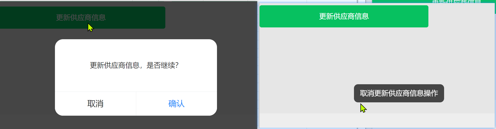

## vant 封装按钮的询问是否继续方法

```html
<div class="btns">
		<van-button type="success" @click="handleConfirmOperation($event,queryKlPn)" class="dbl" :loading="loadingQ"
			loading-type="spinner">根据对标料号获取新莱物料信息</van-button>
		<van-button type="success" @click="handleConfirmOperation($event,confrimGeneratePriceSheet)" class="psheet"
			:loading="loadingG" loading-type="spinner">生成报价单</van-button>
		<van-button type="success" @click="handleConfirmOperation($event,confirmUpdateSupplier)" class="supplier"
			:loading="loadingS" loading-type="spinner">更新供应商信息</van-button>
</div>
```

```js
const handleConfirmOperation = (e, fun) => {
		util.isConfirmOperate(e.target.innerText, fun);
}
```

>util.js
>
>```js
>import {
>	showToast
>	showConfirmDialog
>} from 'vant';
>import 'vant/es/toast/style';
>import 'vant/es/dialog/style';
>export default {
>	isConfirmOperate: (op, fun) => {
>		showConfirmDialog({
>			message: `${op}，是否继续？`,
>			showCancelButton: true,
>		}).then(res => {
>			fun()
>		}).catch((err) => {
>			showToast(`取消${op}操作`)
>		})
>	}
>}
>```
>
>