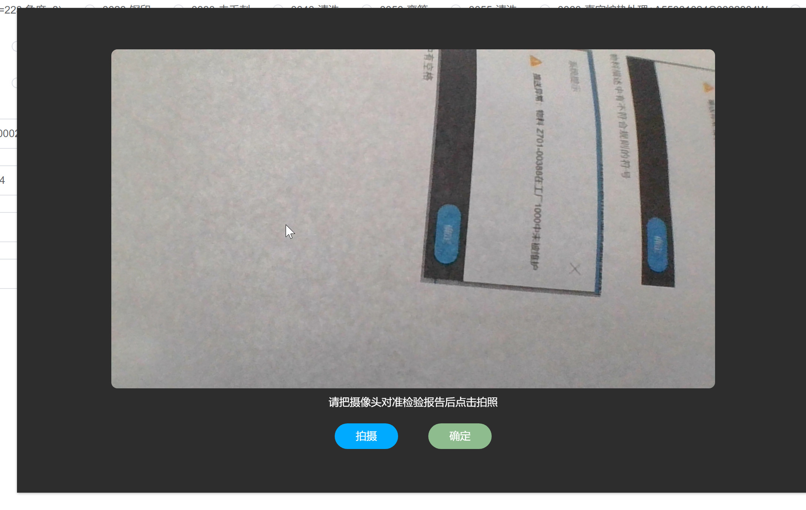
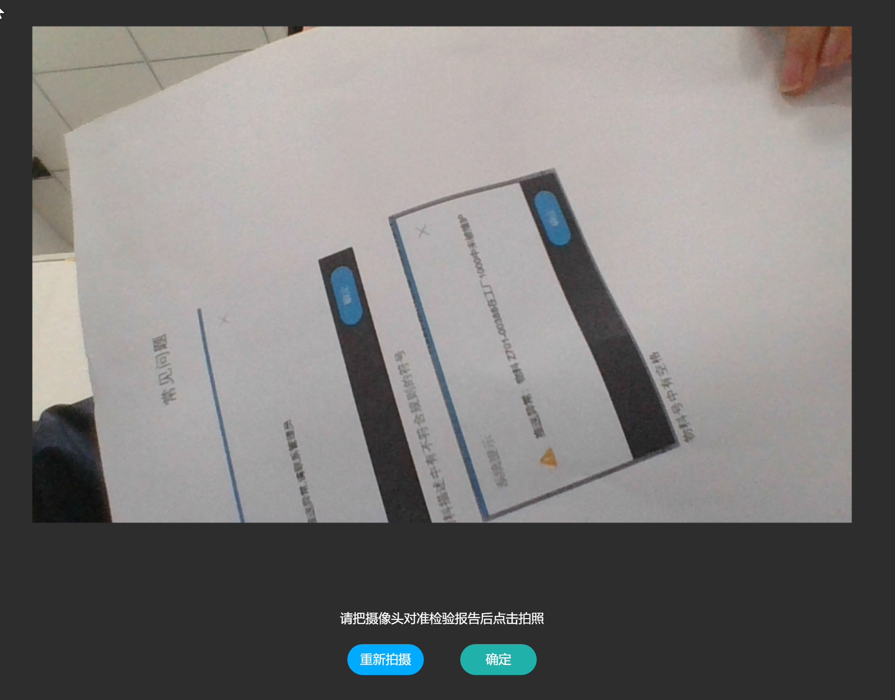

## 父页面
```html
<el-dialog title="" :visible.sync="showDialog" width="70%" center :show-close="false">
	<takePhoto ref="takePhoto" :showVideo="showVideo" @confirmImage="confirmImage">
    </takePhoto>
</el-dialog>
```
```js
CallCamera() {
				this.showDialog = true
				this.showVideo = true
			},

			confirmImage(option) {
				this.imageList.push(option.url)
				this.showDialog = false
				this.showVideo = false
				this.fileList.push(option)
			},
```
## 拍照子组件
```html
<template>
	<div class="video-page">
		<div class="video-content">
			<video ref="video" class="video-item" v-if="internalShowVideo"></video>
			<canvas ref="canvas" width="900" height="546" v-else></canvas>
			<div class="video-buttons">
				<div>请把摄像头对准检验报告后点击拍照</div>
				<div class="" style="display: flex;">
					<div class="btn" @click="capture()">{{internalIsAfresh?"重新拍摄":"拍摄"}}</div>
					<div class="btn" v-if="internalIsAfresh" style="background-color: lightseagreen;"
						@click="confirmImage">确定
					</div>
					<div class="btn" v-else style="background-color: darkseagreen;">确定</div>
				</div>
			</div>
		</div>
	</div>
</template>
```
```js
<script>
	export default {
		props: {
			showVideo: {
				default: false
			}
		},
		data() {
			return {
				internalShowVideo: this.showVideo, // 创建一个内部数据属性
				internalIsAfresh: false
			};
		},
		watch: {
			showVideo: {
				immediate: true,
				handler(value) {
					if (value) {
						this.getUserMedia()
					}
				}
			}

		},

		mounted() {

		},
		methods: {
			getUserMedia() {
				const _this = this;
				_this.internalShowVideo = true
				navigator.mediaDevices.getUserMedia({
						video: {
							width: 1280,
							height: 720
						}
					})
					.then(function(stream) {
						_this.success(stream)
					})
					.catch(function(err) {
						_this.$toast(err);
					});
			},
			success(stream) {
				this.$refs.video.srcObject = stream;
				this.$refs.video.play();
			},
			capture() {
				if (this.internalIsAfresh) {
					this.getUserMedia()
					this.internalIsAfresh = false
				} else {
					var videoElement = this.$refs.video;
					console.log(videoElement);
					this.internalShowVideo = false;
					this.$nextTick(() => {
						// var context = this.$refs.canvas.getContext('2d');
						const videoWidth = videoElement.videoWidth;
						const videoHeight = videoElement.videoHeight;
						const canvas = this.$refs.canvas;
						const context = canvas.getContext('2d');
						canvas.width = videoWidth;
						canvas.height = videoHeight;
						const x = (videoWidth - 900) / 2;
						const y = (videoHeight - 546) / 2;
						/* 要跟video的宽高一致 */
						context.drawImage(videoElement, 0, 0, videoWidth, videoHeight,
							x,
							y,
							900, 546);
						this.internalIsAfresh = true
					})
				}

			},
			confirmImage() {
				const base64Url = this.$refs.canvas.toDataURL()
				const imgFile = this.convertBase64UrlToImgFile(base64Url, 'image/jpg')

				this.internalShowVideo = false
				this.internalIsAfresh = false
				this.$emit('confirmImage', imgFile)
			},
			convertBase64UrlToImgFile(urlData, fileType) {
				const imgData = urlData.split('base64,').splice(-1)[0]
				/* 解码使用 base-64 编码的字符串 转换为byte */
				const bytes = window.atob(imgData)

				/* 处理异常,将ASCII码小于0的转换为大于0 */
				const ab = new ArrayBuffer(bytes.length)
				const ia = new Int8Array(ab)

				for (let i = 0; i < bytes.length; i++) {
					ia[i] = bytes.charCodeAt(i)
				}

				/* 转换成文件，可以添加文件的type，lastModifiedDate属性 */
				const blob = new Blob([ab], {
					type: fileType
				})

				const tempURL = URL.createObjectURL(blob);

				blob.lastModifiedDate = new Date()
				blob.url = tempURL
				return blob
			}
		}
	}
</script>
```
```css
<style scoped>
	.video-page {
		background-color: #2d2d2d;
	}

	.video-content {
		display: flex;
		flex-direction: column;
		align-items: center;

	}

	.video-item {
		border-radius: 8px;
		width: 80%;
		margin: 0 auto;
	}

	.video-buttons {
		text-align: center;
		margin: 8px 0;
		color: #fff;
	}


	.btn {
		width: 80px;
		height: 30px;
		line-height: 30px;
		border-radius: 20px;
		background-color: #00aaff;
		color: #fff;
		margin: 20px;
		padding: 2px;
	}
</style>
```
### 效果图 

